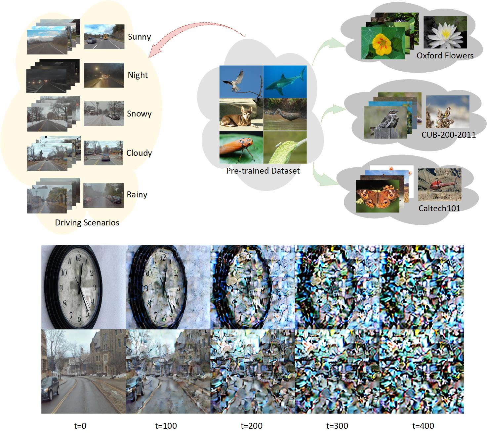
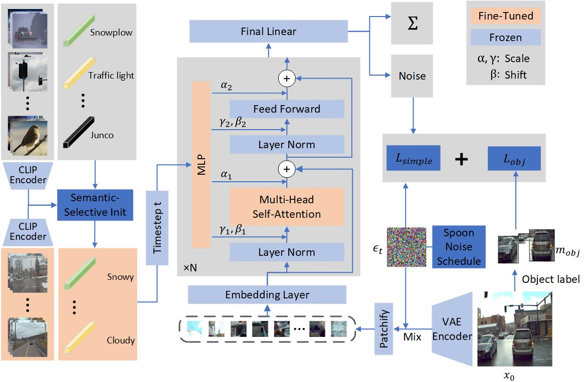
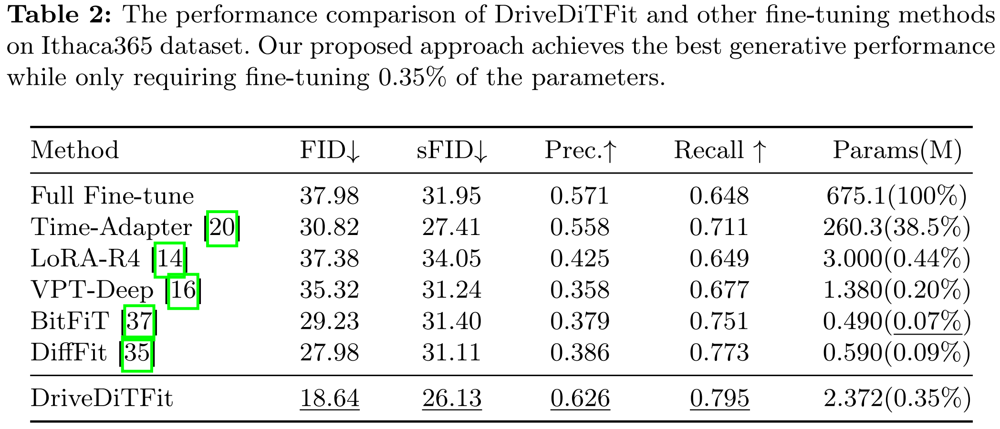
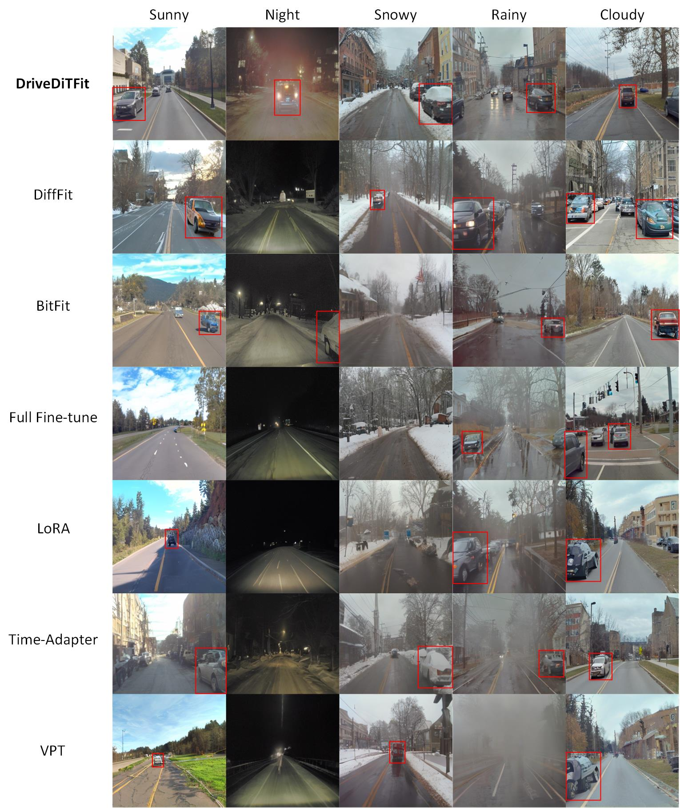

# DriveDiTFit: Fine-tuning Diffusion Transformers for Autonomous Driving.
## Introduction
In autonomous driving, deep models have shown remarkable performance across various visual perception tasks with the demand of high-quality and huge-diversity training datasets. Such datasets are expected to cover various driving scenarios with adverse weather, lighting conditions and diverse moving objects. However, manually collecting these data presents huge challenges and expensive cost. With the rapid development of large generative models, we propose DriveDiTFit, a novel method for efficiently generating autonomous **Driv**ing data by **Fi**ne**T**uning pre-trained **Di**ffusion **T**ransformers (DiTs). Specifically, DriveDiTFit utilizes a gap-driven modulation technique to carefully select and efficiently fine-tune a few parameters in DiTs according to the discrepancy between the pre-trained source data and the target driving data. Additionally, DriveDiTFit develops an effective weather and lighting condition embedding module to ensure diversity in the generated data, which is initialized by a nearest-semantic-similarity initialization approach. Through progressive tuning scheme to refined the process of detail generation in early diffusion process and enlarging the weights corresponding to small objects in training loss, DriveDiTFit ensures high-quality generation of small moving objects in the generated data. Extensive experiments conducted on driving datasets confirm that our method could efficiently produce diverse real driving data.

## Discrpancy between Driving Scenarios and Classification Datasets.


## Method


## Results



## Requirements
### Environment
1. [torch 2.1.2](https://github.com/pytorch/pytorch)
2. [torchvision 0.16.2](https://github.com/pytorch/vision)
3. [timm 0.9.12](https://github.com/huggingface/pytorch-image-models)
4. cuda 12.2

### Datasets
We compare DriveDiTFit and other effecient fine-tuning methods on the [Ithaca365](https://ithaca365.mae.cornell.edu/) dataset and [BDD100K](https://doc.bdd100k.com/download.html) dataset.

## Preprocessing
Coming soon! 

## Fine-Tuning
Coming soon! 

## Acknolegment

The implentation of Diffusion Transformer is based on [DiT](https://github.com/facebookresearch/DiT) and [DiffFit](https://github.com/mkshing/DiffFit-pytorch).


Many thanks to its contributors!

## Citation
If you find our work helpful for your research, please consider citing our work.
```bibtex
@article{tu2024driveditfit,
  title={DriveDiTFit: Fine-tuning Diffusion Transformers for Autonomous Driving},
  author={Tu, Jiahang and Ji, Wei and Zhao, Hanbin and Zhang, Chao and Zimmermann, Roger and Qian, Hui},
  journal={arXiv preprint arXiv:2407.15661},
  year={2024}
}
```